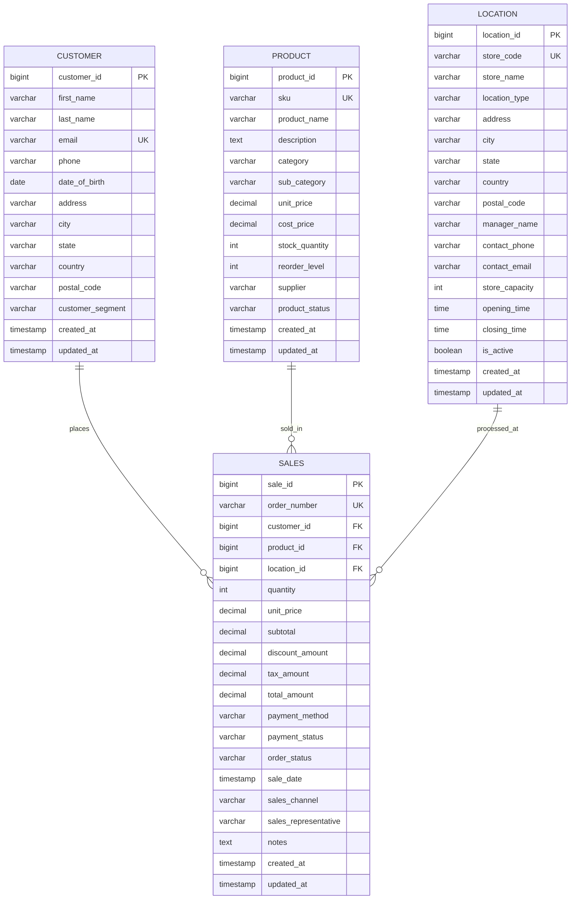

# OLTP Sales Management System - ER Diagram

## Entity-Relationship Diagram

## Relationship Descriptions

### 1. CUSTOMER to SALES (One-to-Many)
- **Relationship**: One customer can place multiple sales orders
- **Cardinality**: 1:N
- **Foreign Key**: `customer_id` in SALES table references `customer_id` in CUSTOMER table
- **Business Rule**: Every sale must be associated with a customer

### 2. PRODUCT to SALES (One-to-Many)
- **Relationship**: One product can be sold in multiple sales transactions
- **Cardinality**: 1:N
- **Foreign Key**: `product_id` in SALES table references `product_id` in PRODUCT table
- **Business Rule**: Every sale must include a product

### 3. LOCATION to SALES (One-to-Many)
- **Relationship**: One location (store/warehouse) can process multiple sales
- **Cardinality**: 1:N
- **Foreign Key**: `location_id` in SALES table references `location_id` in LOCATION table
- **Business Rule**: Every sale must be processed at a location

## Key Attributes

### Primary Keys (PK)
- `customer_id`: Unique identifier for each customer
- `product_id`: Unique identifier for each product
- `location_id`: Unique identifier for each location
- `sale_id`: Unique identifier for each sale transaction

### Unique Keys (UK)
- `email`: Ensures each customer has a unique email address
- `sku`: Stock Keeping Unit - unique product identifier
- `store_code`: Unique code for each store/location
- `order_number`: Unique order number for each sale

### Foreign Keys (FK)
- `customer_id` in SALES: Links to CUSTOMER table
- `product_id` in SALES: Links to PRODUCT table
- `location_id` in SALES: Links to LOCATION table

## Database Indexes

The system includes indexes on frequently queried columns for optimal OLTP performance:

### CUSTOMER
- `idx_email` on `email`
- `idx_phone` on `phone`

### PRODUCT
- `idx_sku` on `sku`
- `idx_category` on `category`
- `idx_product_status` on `product_status`

### LOCATION
- `idx_store_code` on `store_code`
- `idx_city` on `city`
- `idx_location_type` on `location_type`

### SALES
- `idx_sale_date` on `sale_date`
- `idx_customer_id` on `customer_id`
- `idx_product_id` on `product_id`
- `idx_location_id` on `location_id`
- `idx_order_status` on `order_status`

## OLTP Optimization Features

1. **Normalized Structure**: All tables follow 3NF (Third Normal Form) to minimize data redundancy
2. **Indexed Foreign Keys**: All foreign keys are indexed for fast JOIN operations
3. **Unique Constraints**: Email, SKU, store code, and order numbers have unique constraints
4. **Audit Timestamps**: `created_at` and `updated_at` fields track record changes
5. **Data Integrity**: Foreign key constraints with named constraints for referential integrity
6. **Lazy Loading**: ManyToOne relationships use lazy fetching to optimize performance
